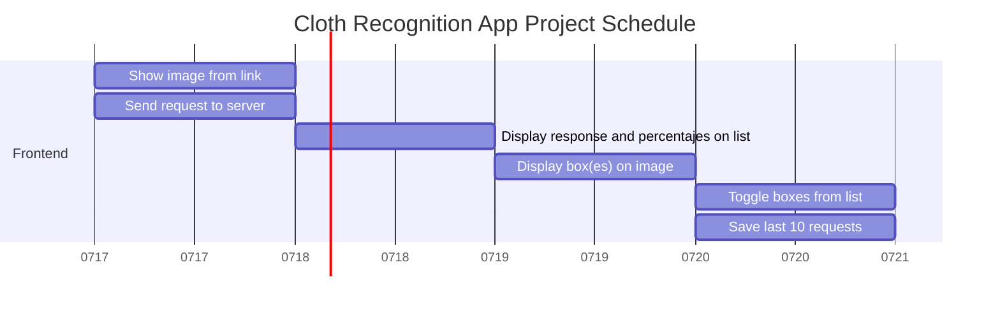

# Cloth Recognition App - Frontend

This project allows the user to load an image link to identify and display the different cloths and accesories on the image surrounded within a box

### Projects Goals

- [ ] Feature - Users system
- [ ] Insert and image link and display the image on the website
- [ ] Click on a button to display the different boxes on the image
- [ ] Show amount of entries 
- [ ] Profile modal that shos user's info
- [ ] A list of the different boxes
- [ ] Toggle option to display/hidde an specific box
- [ ] A list of the past 10 images loaded

